# (C# 코딩) 파일 비교툴
## 개요
- C# 프로그래밍 학습
- 1줄 소개: 두 폴더의 파일들을 비교해서 상호 복사하는 툴
- 사용한 플랫폼:
	- C#, .NET Windows Forms, Visual Studio, GitHub
- 사용한 컨트롤:
	- Label, TextBox, ListBox, Button, SplitContainer, Panel, ListView
- 사용한 기술과 구현한 기능:
	- 컨트롤 배치 및 이벤트 처리
	- 폴더 선택 기능 (FolderBrowserDialog)
	- 파일 리스트 기능 구현 (색상 구분 표시)

## 실행 화면 (과제1)
- 코드의 실행 스크린샷과 구현 내용 설명

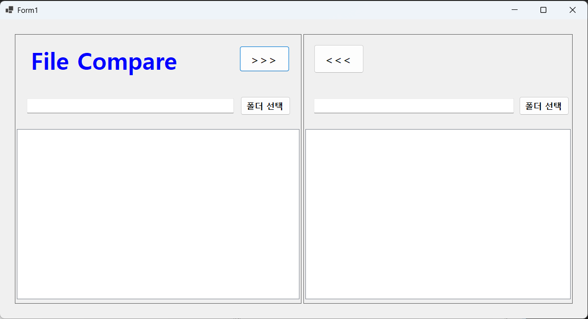

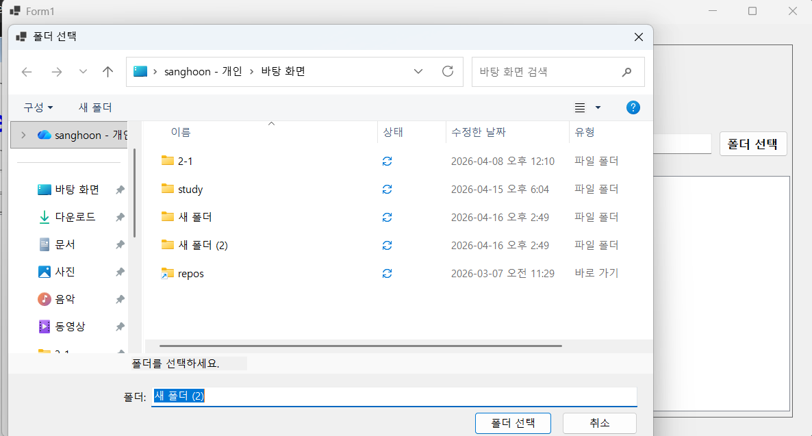

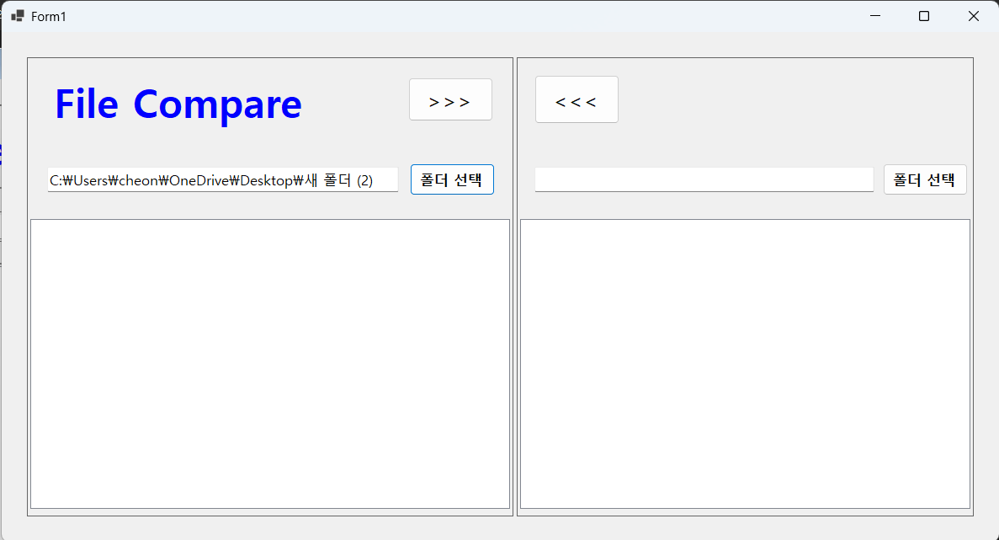

- 구현한 내용 (위 그림 참조)
	- UI 구성 : 주어진 환경에 맞게 GUI 설계 및 컨트롤 배치
	- 폴더 선택 : 폴더 선택 버튼을 통해 폴더 경로를 입력받아 textBox에 표시(FolderBrowserDialog 사용)

## 실행 화면 (과제2)
- 코드의 실행 스크린샷과 구현 내용 설명

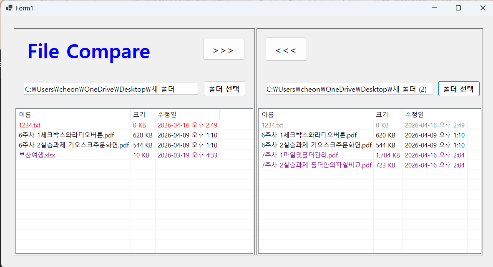

- 구현한 내용 (위 그림 참조)
	- 파일 리스트 기능 구현 : 선택된 폴더의 파일 리스트를 ListBox에 표시
	- 색상 구분 표시 : 파일의 상태에 따라 색상을 다르게 표시

## 실행 화면 (과제3)
- 코드의 실행 스크린샷과 구현 내용 설명

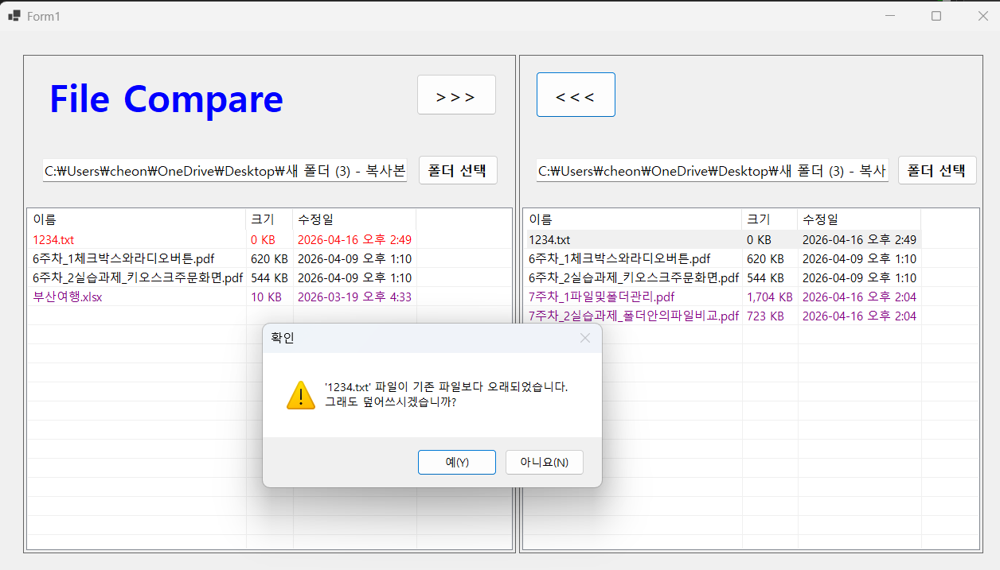

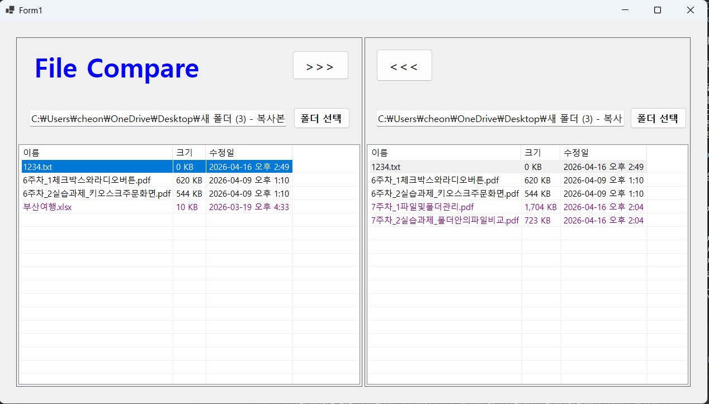

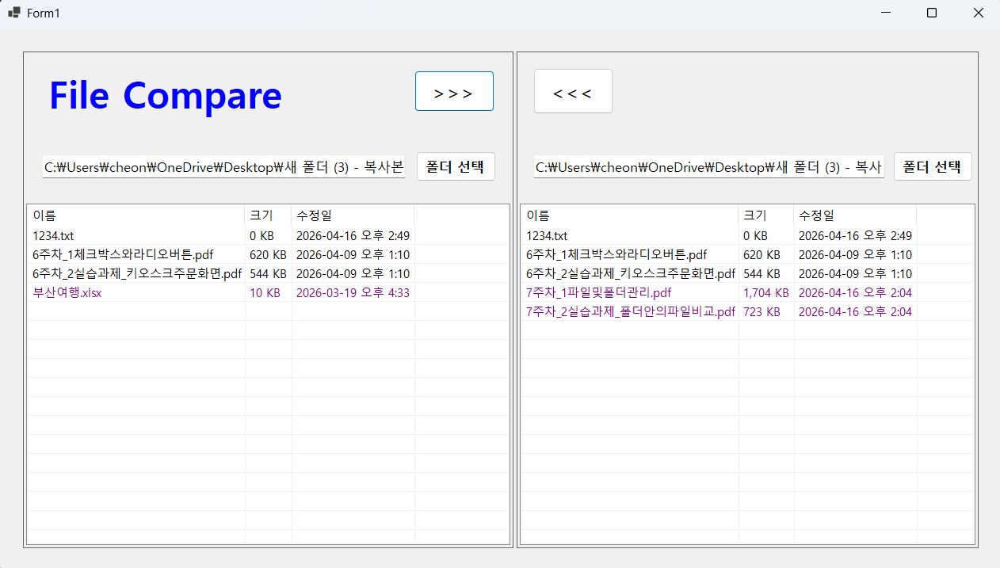

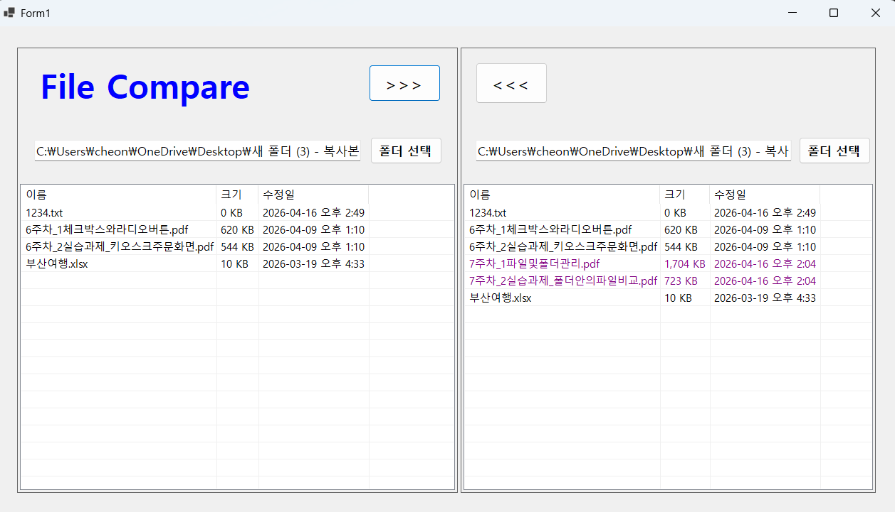

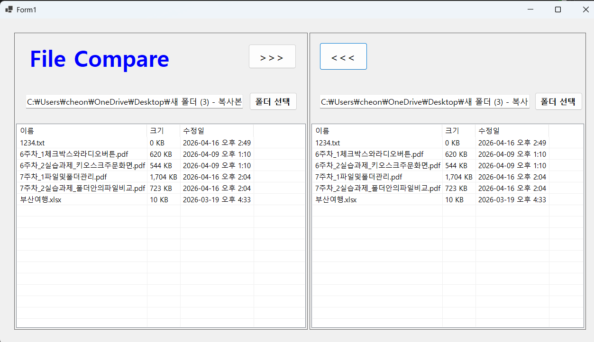

- 구현한 내용 (위 그림 참조)
	- copyselectedfiles() 메서드를 통해선택된 파일을 복사하는 기능 구현
	- 복사하려는 파일이 기존 파일보다 오래된 경우 확인 메시지 표시하는 기능 구현
	- 이외의 경우에는 복사 바로 실행

## 실행 화면 (과제4)
- 코드의 실행 스크린샷과 구현 내용 설명

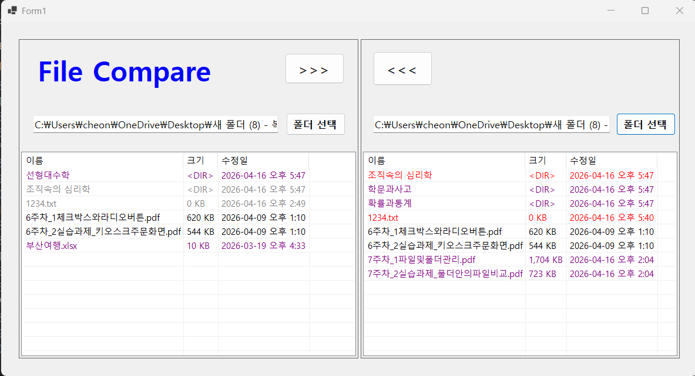

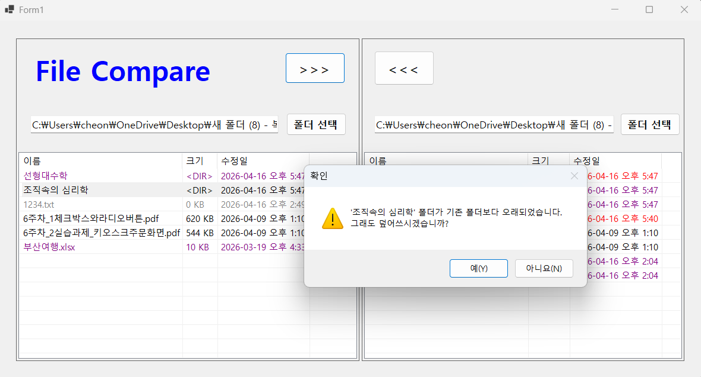

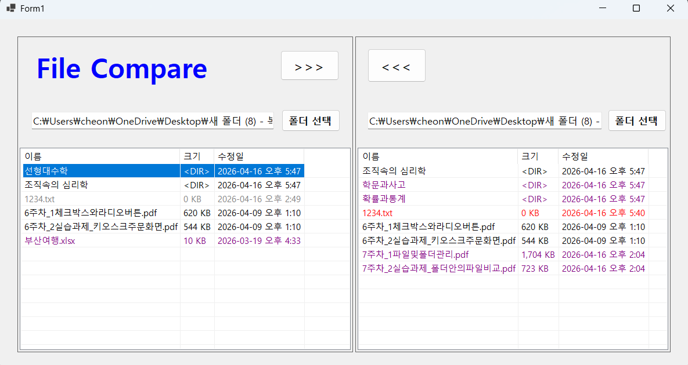

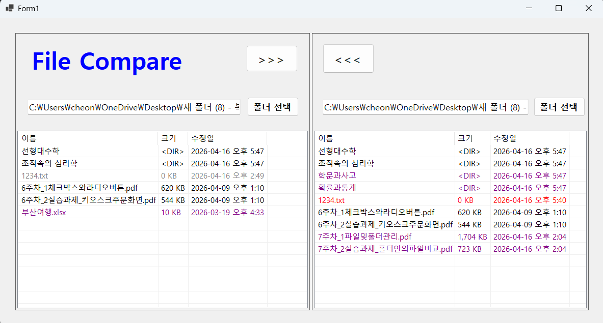

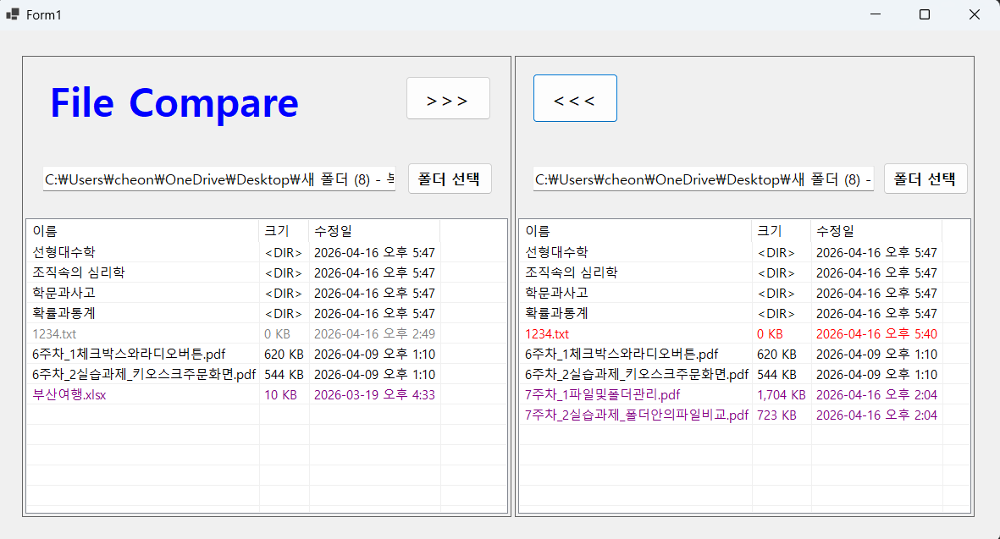

- 구현한 내용 (위 그림 참조)
	- copydirectory() 메서드를 통해 선택된 폴더를 복사하는 기능 구현
	- 이전 로직과 동일하게 복사하려는 폴더가 기존 폴더보다 오래된 경우 확인 메시지 표시하는 기능 구현
	- 이전 로직과 동일하게 색상 구분 표시 기능 구현
	- 복사 버튼 누르면 하위폴더의 모든 내용 (파일과 하위폴더 포함) 처리